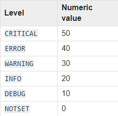

# Бот для создания аватарок

Бот для создания аватарок для акций. Накладывает изображение/изображения (маску) поверх другого изображения.
## Настройка
1. Загрузите изображения в формате png в папку `masks`. Они должны быть пронумерованы от 0. Размер может любым (больше - лучше, но перебарщивать не стоит), однако пропорции сторон должны быть 1 к 1;
2. Укажите в свой токен бота в файле `vars.env`;
3. Отредактируйте конфигурационный файл (`config.py`) для своих нужд.
### Возможные уровник логгирования

    

